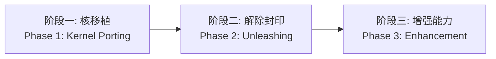

**做世界上最好用的 Agent 系统。** / _Building the most usable agent system._

我们相信 LLM 的潜力远未在真实实践中被全面激发——问题不在基座，在工程。



**做 Agent 工程的人，自己不用自己造出来的东西的吗？**

大量真实实践中浮现出来的问题是极其低级的，甚至只要稍微用几次，作为一个实践者都难以忍受。LLM 的潜力远未被真实释放——真正的瓶颈不是模型能力，而是工程结构。

---

### 核心论文 / Core Papers





我们对 Agent 系统的思考已经形成三篇核心论文，从理论、治理到工程实现层层递进：

1. **长程实践：超越单次能力的结构下限** — 理论基座。定义了"长程实践"的形式结构，揭示单次能力与长程能力之间的三段非蕴含链，建立三层结构下限体系。[PDF](/assets/pdf/long-horizon-cn.pdf) | [DOI](https://doi.org/10.5281/zenodo.20470866)

2. **从黑圣杯到令咒系统：长程实践的离散本质与Agent治理边界** — 治理架构。七系统源码调研表明治理不是工程可选项，而是结构必需品。[PDF](/assets/pdf/black-grail-command-spell-cn.pdf) | [DOI](https://doi.org/10.5281/zenodo.21532460)

3. **面向长程实践的锚点与契约：AC范式V6技术报告（TRAE特调）** — 工程实现。锚点-契约-审查三层结构在 TRAE IDE 上的首个完整工程实例，102 小时连续攻坚案例。[PDF](/assets/pdf/ac-paradigm-v6-tr-cn.pdf) | [DOI](https://doi.org/10.5281/zenodo.20471461)





Our thinking on Agent systems has been consolidated into three core papers, progressing from theory to governance to engineering implementation:

1. **Long-Horizon Practice: Structural Lower Bounds Beyond Single-Step Capability** — Theoretical foundation. Defines the formal structure of long-horizon practice, revealing the three-link chain of non-implication between single-step and long-horizon capability. [PDF](/assets/pdf/long-horizon-en.pdf) | [DOI](https://doi.org/10.5281/zenodo.20470866)

2. **From the Black Grail to the Command Spell System: The Discrete Nature of Long-Horizon Practice and the Boundaries of Agent Governance** — Governance architecture. Seven-system source-code investigation demonstrating that governance is not an option but a structural necessity. [PDF](/assets/pdf/black-grail-command-spell-en.pdf) | [DOI](https://doi.org/10.5281/zenodo.21532460)

3. **Anchors and Contracts for Long-Horizon Practice: AC Paradigm V6 Technical Report (TRAE-Tuned)** — Engineering implementation. The first complete engineering instantiation of the anchor-contract-review three-layer structure on TRAE IDE, with a 102-hour continuous deep-dive case study. [PDF](/assets/pdf/ac-paradigm-v6-tr-en.pdf) | [DOI](https://doi.org/10.5281/zenodo.20471461)





---

### 工程路线 / Roadmap

Eureka Agent 三阶段路线：

- **阶段一（当前）**：将 AC 范式 V6 能力移植为独立 Agent 运行时核
- **阶段二**：突破平台接口限制，实现独立进程管理和跨 session 状态持久化
- **阶段三**：多 Agent 协作、自我进化与社区工具生态



---

### 加入我们 / Join Us





如果你也认同这些想法——LLM 的潜力远未被真实释放，Agent 系统需要治理优先的架构设计，长程实践需要结构性的工程保障——那么欢迎你加入我们。

这是一个开源、开放的项目。我们在 GitHub 上等你：[Eukaryon Project](https://github.com/jopsammy/eukaryon_project)





If you share these beliefs—that LLM potential is far from fully released, that agent systems need governance-first architecture, and that long-horizon practice requires structural engineering guarantees—then you are welcome to join us.

This is an open-source, open project. We are waiting for you on GitHub: [Eukaryon Project](https://github.com/jopsammy/eukaryon_project)




