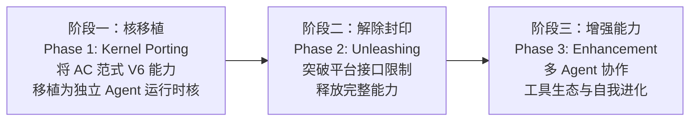

<!-- _pages/roadmap.md -->

Eureka Agent 三阶段路线（three-phase roadmap）——从核移植（kernel porting）、解除封印（unleashing），到增强能力（enhancement）。每阶段都有明确的里程碑与依赖前提，整体方向是演化（evolutionary），而非一次性设计（not one-shot design）。

### 阶段一：核移植（Phase 1: Kernel Porting） —— 当前进行中

将 AC 范式 V6 在 TRAE IDE 上验证过的工程能力——锚点（anchor）、契约（contract）、独立审查（independent review）、subagent 对冲调度（parallel-sub-agent hedging）——移植为独立 Agent 运行时核（standalone agent runtime kernel）。

里程碑（milestones）：

- 从 102 小时连续攻坚案例中抽出锚点—契约—审查三层结构的可复用内核组件
- 把 TRAE IDE 特定的接口适配层抽象为平台无关边界（platform-agnostic boundary）
- 形成可在多种 agent 工具上复现的最小可运行核（minimal runnable kernel）

依赖前提（prerequisites）：已具备 TRAE 上 AC 范式 V6 的完整工程化经验（参见 [projects / 项目]({{ '/projects/' | relative_url }}) 中 AC 范式 V6 卡片与 [research / 研究]({{ '/research/' | relative_url }}) 中 AC 范式 V6 技术报告）。

### 阶段二：解除封印（Phase 2: Unleashing）

突破 TRAE IDE 作为单一容器的平台接口限制（platform interface constraints），释放完整能力。目标是让 Agent 运行时核可以独立生存，不再依赖宿主 IDE。

关键节点（key nodes）：

- 独立进程管理（independent process management）：脱离宿主进程，自管生命周期
- 外部工具链集成（external toolchain integration）：开放工具市场而非受单 IDE 工具集约束
- 跨 session 状态持久化（cross-session state persistence）：状态可在外部存储中连续

依赖前提：阶段一已沉淀稳定内核，且把适配层抽象清楚。治理基础设施（真核，true nucleus）已可作为外部服务被独立运行时核调用。

### 阶段三：增强能力（Phase 3: Enhancement）

在稳定独立运行时核之上，叠加多 Agent 协作（multi-agent collaboration）、自省与自我进化能力（introspection and self-evolution），以及社区工具生态（community tool ecosystem）。

方向（directions）：

- 多 Agent 协作框架：在治理基础设施上定义 Agent 间的契约与权限边界
- 自我省与演化：从真实部署的失败中学习（learning from real deployment failures），而非一次性设计
- 社区工具生态：开放工具与模板市场，让 Agent 系统走"演化"路径

依赖前提：阶段二已摆脱宿主耦合，治理基础设施可作为可组合的服务消费；此时叠加协作与生态才不破坏长程下限（long-horizon lower bounds）。

---

## 收尾

路线会演化，不会一次性设计——治理不是工程可选项，是结构必需品（governance is not an engineering option, it's structurally necessary）。当前我们处在阶段一的内核移植阶段，欢迎在 [GitHub](https://github.com/jopsammy/eukaryon_project) 上同行。
