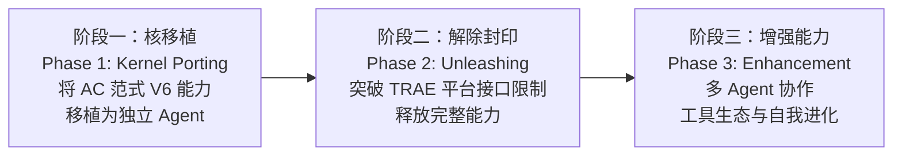

> **解决什么**：为长程实践提供独立、可移植的 Agent 运行时核。
> **当前状态**：阶段一核移植进行中。
> **入口**：[roadmap / 路线]({{ '/roadmap/' | relative_url }}) · [GitHub](https://github.com/jopsammy/eukaryon_project)

### Eureka Agent

**使命（Mission）**：做世界上最好用的 Agent 系统（building the most usable agent system）。

Eureka Agent 是一个从零构建的 Agent 运行时核（from-scratch agent runtime kernel），专为长程实践（long-horizon practice）设计。它的设计围绕三个核心原则（three core principles）：

1. **契约连续性（Contract Continuity）**：跨检查点的结构化状态传递（structured state handoff across checkpoints），确保任务不会在切换上下文时断裂
2. **治理优先（Governance First）**：内置权限闸门、检查点机制和机向人请示通道（built-in permission gates, checkpoint mechanisms, and machine-to-human request channels）
3. **演化架构（Evolutionary Architecture）**：支持从失败中学习和迭代（learning and iterating from failures），而非一次性设计（not one-shot design）

#### 三阶段路线（Three-Phase Roadmap）

**阶段一（当前，Phase 1 Current）**：将 AC 范式 V6 在 TRAE 上验证的工程能力移植为独立 Agent 运行时核（port AC Paradigm V6 capabilities into a standalone kernel）。

**阶段二（Phase 2）**：突破 TRAE IDE 的平台接口限制（break through TRAE IDE platform constraints），实现独立进程管理、外部工具链集成和跨 session 状态持久化（independent process management, external toolchain integration, cross-session state persistence）。

**阶段三（Phase 3）**：多 Agent 协作框架、自省与自我进化能力、社区工具生态（multi-agent collaboration framework, introspection and self-evolution, community tool ecosystem）。

完整路线展开见 [roadmap / 路线]({{ '/roadmap/' | relative_url }})。
