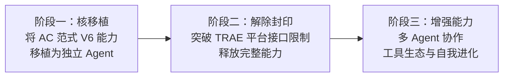
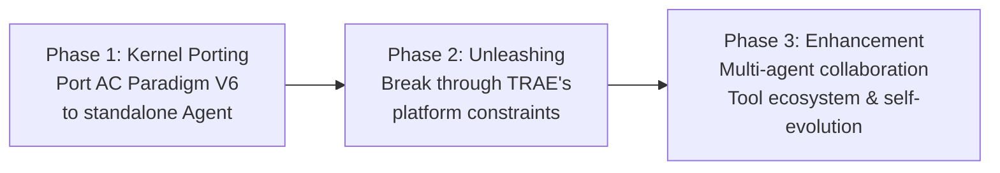




### Eureka Agent

**使命**：做世界上最好用的 Agent 系统。

Eureka Agent 是一个从零构建的 Agent 运行时核，专门为长程实践设计。它的设计围绕三个核心原则：

1. **契约连续性**：跨检查点的结构化状态传递，确保任务不会在切换上下文时断裂
2. **治理优先**：内置权限闸门、检查点机制和机向人请示通道
3. **演化架构**：支持从失败中学习和迭代，而非一次性设计

#### 三阶段路线

**阶段一（当前）**：将 AC 范式 V6 在 TRAE 上验证的工程能力移植为独立 Agent 运行时核。

**阶段二**：突破 TRAE IDE 的平台接口限制，实现独立进程管理、外部工具链集成和跨 session 状态持久化。

**阶段三**：多 Agent 协作框架、自省与自我进化能力、社区工具生态。





### Eureka Agent

**Mission**: Building the most usable agent system.

Eureka Agent is a from-scratch agent runtime kernel designed for long-horizon practice. Its design revolves around three core principles:

1. **Contract Continuity**: Structured state handoff across checkpoints ensures tasks don't break when switching contexts
2. **Governance First**: Built-in permission gates, checkpoint mechanisms, and machine-to-human request channels
3. **Evolutionary Architecture**: Learning and iterating from failures rather than one-shot design

#### Three-Phase Roadmap

**Phase 1 (Current)**: Port the engineering capabilities validated on TRAE under AC Paradigm V6 into a standalone agent runtime kernel.

**Phase 2**: Break free from TRAE IDE platform constraints—implement independent process management, external toolchain integration, and cross-session state persistence.

**Phase 3**: Multi-agent collaboration framework, introspection and self-evolution capabilities, community tool ecosystem.



